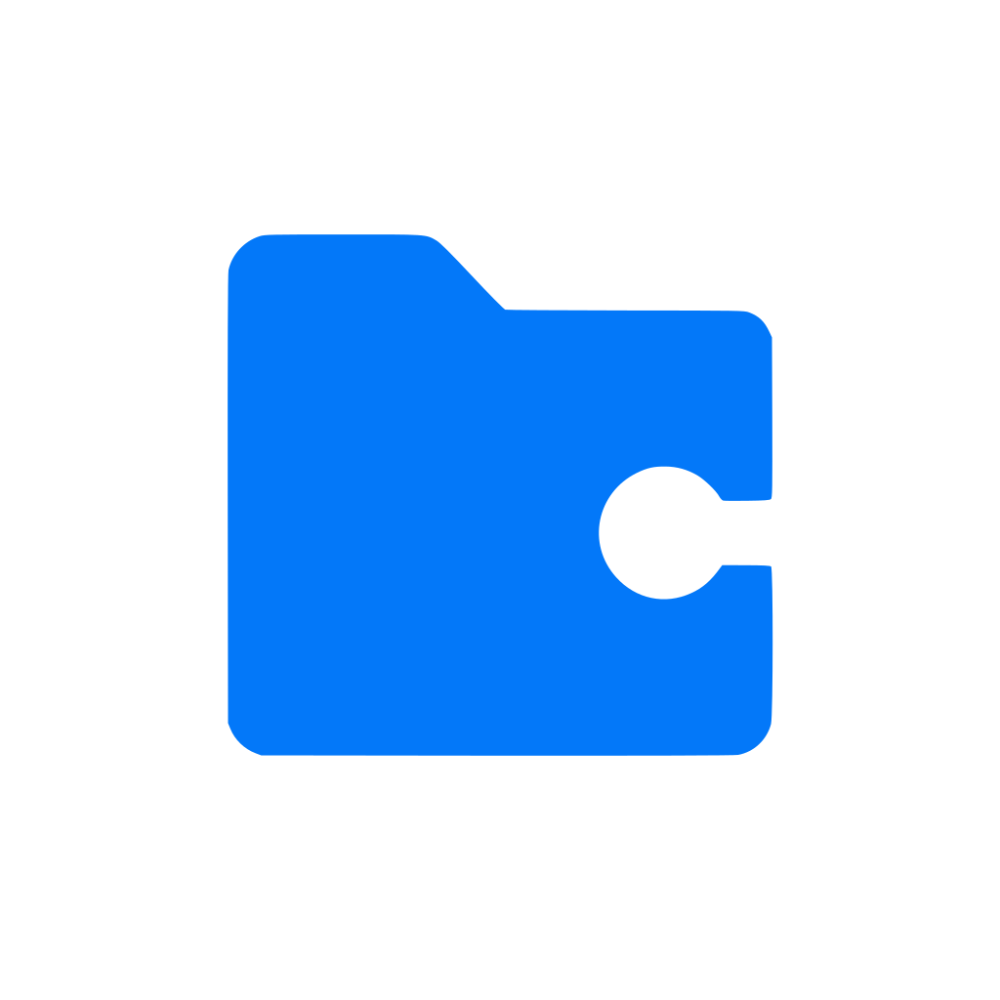
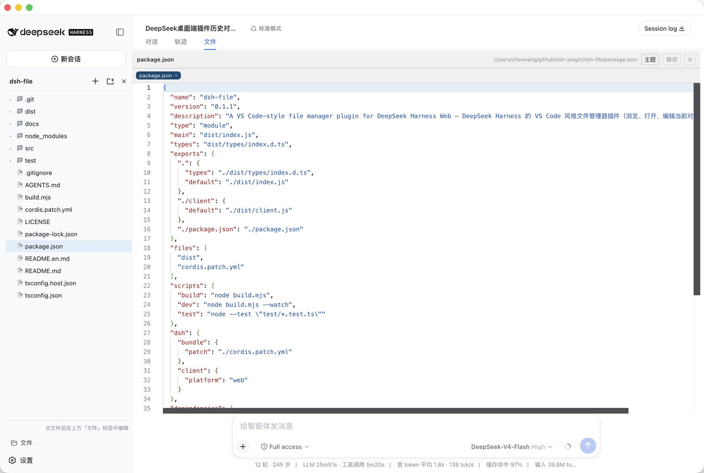

<p align="center">
  
</p>

<p align="center">
  <a href="https://github.com/chengzhi43/dsh-explorer-editor">GitHub</a> ·
  <a href="#installation">Installation</a> ·
  <a href="#themes">Theme import/export</a> ·
  <a href="#faq">FAQ</a> ·
  <a href="https://github.com/chengzhi43/dsh-explorer-editor/issues">Issues</a> ·
  <a href="https://github.com/chengzhi43/dsh-explorer-editor/releases">Releases</a>
</p>

<p align="center">
  <a href="https://github.com/chengzhi43/dsh-explorer-editor/releases"></a>
  <a href="LICENSE"></a>
  
  <a href="https://github.com/chengzhi43/dsh-explorer-editor"></a>
  
  
</p>

<p align="center"><b>English</b> · <a href="README.md">简体中文</a></p>

---

# dsh-explorer-editor

> A VS Code-style file manager plugin for DeepSeek Harness Web: browse the current conversation's workspace from the sidebar and edit files in the center column.
>
> DeepSeek Harness 的 VS Code 风格文件管理器插件：在 Web 侧边栏浏览当前对话工作区的文件，在中间主区域编辑。

## Screenshot

<p align="center">
  
</p>

Browse the workspace in the sidebar tree; clicking a file opens it in the center-column "Files" view (Monaco editor with syntax highlighting).

## Installation

<a id="installation"></a>

```sh
# Run from inside the cloned dsh-explorer-editor directory (not its parent)
cd /path/to/dsh-explorer-editor
dsh plugin --profile web add .
```

`dsh plugin add` pnpm-links the package into the profile and appends it to `dsh.profile.bundles`. **Restart `dsh web` to take effect** (client plugin metadata is cached by name; it is rescanned after a restart).

### DSH Desktop install

The desktop client is the [deepseek-harness-desktop](https://github.com/anywhere-labs/deepseek-harness-desktop) project (package `dsh-plugin-desktop`). It uses a **separate profile** (`desktop`) from `dsh web` (`web`), and plugins are **not shared** between them — a plugin installed only into the `web` profile will not appear in the desktop client, nor in its Settings → Plugins list:

```sh
# Run from inside the dsh-explorer-editor directory as well
cd /path/to/dsh-explorer-editor
dsh plugin --profile desktop add .
```

After installing, **fully quit and relaunch the desktop app** (quit the application, not just close the window); `dsh-explorer-editor` will then show up in the sidebar footer "Files" button and in Settings → Plugins.

> Note: do not add plugins to `~/.dsh/profiles/desktop/cordis.yml` — the desktop client rewrites it to an empty list `[]` on every startup. The correct entry point is `dsh.profile.bundles` + `dependencies` in the profile's `package.json` (which is exactly what `dsh plugin add` does).

### Install from npm

```sh
dsh plugin --profile web add dsh-explorer-editor
```

Or download the tarball from [Releases](https://github.com/chengzhi43/dsh-explorer-editor/releases) and install it locally (use `--profile desktop` for the desktop app):

```sh
dsh plugin --profile web add ./dsh-explorer-editor-0.7.0.tgz
```

### Configuration

The `root` in `cordis.patch.yml` is only the **fallback root when there is no session** (defaults to `process.cwd()`). When the file manager opens, the browser resolves the current conversation's workspace directory and re-pins the root via `setRoot`, so usually nothing needs to change:

```yaml
- insert:
    - id: dsh-explorer-editor
      name: 'dsh-explorer-editor'
      config:
        root: !!js process.cwd()   # fallback root only, before the file manager pins the session workspace
```

## Features

- **"Files" button at the sidebar footer**: toggles the sidebar body into the file manager (file tree) and back to the workspace/session list
- **Workspace follows the active conversation**: opening the file manager resolves the current session's workspace directory (`SessionHeader.cwd`) and re-pins the gateway root via `setRoot` — no longer the directory `dsh web` was launched from
- **Center-column editor (view tab)**: the editor is registered as a `conversation.view` view ("Files" tab, alongside Chat/Trajectory). Clicking a file opens it **inside the session scroll area of the page** (not a popup): Monaco Editor (the same kernel VS Code uses, loaded from CDN) with extension-based syntax highlighting; falls back to a plain textarea when the CDN is unreachable
- **Markdown preview**: `.md` files open in **source mode (editable) by default**; a VS Code-style **preview/source toggle button** sits next to the "Theme" button in the toolbar (shown only for Markdown files) to switch to a **read-only rendered preview** (marked + GFM: headings, lists, tables, task lists, code blocks). The chosen mode is remembered (localStorage) and reused on the next open
- **Theme settings (VS Code style)**: the "Theme" button in the editor toolbar opens a settings panel — light by default, presets selected via a **dropdown** (Light/Dark/One Dark/GitHub), plus custom background / foreground colors and font size (10–28px), applied live to Monaco and the editor chrome (toolbar/status/tabs follow the background), persisted to localStorage
- **Theme import/export**: export the current theme to a JSON file and import it back, just like VS Code, to migrate your colors between environments (see [Theme import/export](#themes))
- **Edit & save**: Ctrl+S or the "Save" button in the editor, dirty marker (●); multiple open files switch via the top tab strip, each tab has a ✕ close button
- **File operations**: create file, create directory, rename, delete (delete requires confirmation; non-empty directories are rejected)
- **Right-click context menu (VS Code style)**: right-click a file/directory for **Cut / Copy / Rename / Delete / Copy Path / Copy Relative Path**; right-click a directory or blank tree area to additionally **Paste** (cut → move, copy → recursive copy, existing targets are not overwritten). Delete asks for confirmation and rejects non-empty directories. Cut sources are dimmed; the clipboard survives panel switches (lost on page reload)
- **Encoding auto-detection**: text files are read as UTF-8 first, falling back to **GBK/GB2312** when the bytes are not valid UTF-8 (common for Windows-generated logs/exports) — no more garbled Chinese. Saving the file normalizes it to UTF-8
- **Session restore (survives reloads)**: open tabs and **unsaved edits** persist to localStorage automatically — refresh the page and the last tabs (with unsaved changes) come back. Files larger than 256KB restore their tab only and re-read content from disk; tabs never leak across workspaces; storage is per-browser
- **Live tree refresh (SSE push)**: the host watches the workspace with recursive `fs.watch` and pushes filesystem changes to the browser over SSE — the tree reloads only the affected directories (VS Code Explorer-like). Refocusing the window triggers a full backstop refresh
- **Workspace boundary**: every path resolves against the currently pinned `root`; escaping paths are rejected by the host (including symlink-escape protection)

## Theme import/export

<a id="themes"></a>

The theme panel (the "Theme" button in the editor toolbar) can export the current theme to a JSON file or import one back — the same idea as VS Code theme files, handy for moving your colors across machines or environments.

### Export a theme

1. Open the file editor (the "Files" view in the center column).
2. Click the **Theme** button in the toolbar to open the settings panel.
3. Click **Export theme** — the browser downloads a `dsh-file-theme-YYYY-MM-DD.json` file.

The exported JSON carries both the plugin's flat fields and VS Code workbench `colors`:

```json
{
  "name": "dsh-explorer-editor · One Dark",
  "type": "dsh-file-theme",
  "version": 1,
  "background": "#282c34",
  "foreground": "#abb2bf",
  "fontSize": 13,
  "colors": {
    "editor.background": "#282c34",
    "editor.foreground": "#abb2bf"
  }
}
```

### Import a theme

1. Open the theme settings panel.
2. Click **Import theme** and pick a JSON file.

Accepted formats:

- **This plugin's export format** (`background` / `foreground` / `fontSize`);
- **VS Code theme JSON**: reads `colors["editor.background"]` and `colors["editor.foreground"]` (`tokenColors` are not applied yet — syntax highlighting keeps Monaco's built-in colors).

On success the colors apply immediately and are persisted to localStorage; invalid JSON or missing valid colors shows an error in the panel.

## Architecture

The plugin has two halves sharing the package name `dsh-explorer-editor`:

| | Host half (Node process) | Client half (browser React) |
|---|---|---|
| Source | `src/index.ts` | `src/client/` |
| Build output | `dist/index.js` (tsc, keeps standard decorators) | `dist/client.js` (esbuild, ModuleLoader bundle) |
| Responsibility | Filesystem RPC | Sidebar file tree + center-column editor view |
| Key API | `class FileManagerGateway extends TypertRemoteService` + `@Remote()` | `ctx.slots.register()`, `ctx.remote.$mount()` |

### Host ↔ Client communication (Typert Remote)

Browsers cannot touch the filesystem directly, so the host half exposes file operations as RPC endpoints (namespace `fileManager`: `listDir` / `readText` / `writeText` / `createFile` / `createDirectory` / `rename` / `copy` / `delete` / `stat` / `resolve` / `getRoot` / `setRoot`). The client mounts the call surface with `ctx.remote.$mount(TYPERT_REMOTE)` and resolves the service via `ctx.get('remote.fileManager')`. `setRoot` re-pins the gateway root to the current session's workspace directory.

**Key constraint (SRC descriptor contract)**: the Typert gateway derives wire parameter names from method signatures via `Function.prototype.toString` — host methods must use **flat parameters** (`listDir(path: string)`, not `listDir(input: {...})`); the parameter names are the wire fields the client sends. Both halves must use identical names.

### Panel toggle mechanism

The sidebar main area is the single-seat `sidebar.workspaces` slot (occupied by the workspace browser at priority 0). The plugin registers its own shadow entry at `priority: -1` when the button is clicked — a single-seat slot renders the lowest-priority live entry, so the file manager wins the cell; closing disposes the entry and the workspace browser returns. After clicking a file in the tree, the editor renders in the "Files" view registered in `conversation.view` — the session scroll area of the center column (alongside chat / trajectory), entered via the "Files" tab in the session header, never a popup.

### Dependency resolution (important)

The `@deepseek-ai/*` packages **must not** be installed as copies inside the plugin's own `node_modules`: `@Remote` decorator markers live in a module-level WeakMap, and if the plugin and the api-gateway each hold a separate `dsh-typert-protocol` instance the markers are invisible to each other (RPC returns 404). Node must resolve to the same instance as the dsh installation:

```sh
# Local development (when dsh is installed locally via npx):
ln -s ~/.dsh/profiles/node_modules/@deepseek-ai node_modules/@deepseek-ai
```

At startup `dsh` maintains a flat symlink fallback at `$DSH_HOME/profiles/node_modules` (`healProfilesModuleFallback`) pointing at every package in the dsh installation. For production releases the plugin declares `@deepseek-ai/*` as `peerDependencies`, provided by the profile.

**Desktop app (deepseek-harness-desktop) notes**:

- On startup the desktop app re-points `~/.dsh/profiles/node_modules/@deepseek-ai` at the **packaged Desktop.app directory** (`/Applications/DSH Desktop.app/.../app.asar.unpacked/node_modules`), which **strips `.d.ts` files** — keeping the symlink above pointing at `profiles` guarantees the plugin loads the same runtime instance as the desktop api-gateway (RPC works).
- The stripped types break `tsc`. `tsconfig.json` uses `paths` to map the **compile-time** lookup of `@deepseek-ai/*` to the global dsh install (which ships full `.d.ts`); runtime resolution is unaffected (Node still walks the node_modules symlink → profiles → desktop instance). Adjust the path per the comment in `tsconfig.json` if your global dsh lives elsewhere.
- **Do not run `npm install` inside the plugin directory**: npm dereferences the `node_modules/@deepseek-ai` symlink into a real directory and corrupts the profiles symlink structure, making `dsh` fail with "exists and is not a symlink". If you must add dependencies, re-run the `ln -s` above afterwards.

## Development

```sh
npm install                       # esbuild + typescript + types
node build.mjs                    # build host (tsc) + client bundle (esbuild)
node build.mjs --watch            # watch client only (rerun for host changes)
```

Build outputs:
- `dist/index.js` — host half (Node ESM; compiled with tsc to keep the standard stage-3 decorators; esbuild would lower `@Remote` to the legacy form and crash at runtime)
- `dist/client.js` — client half (`window.__ModuleLoader__.load({id, factory})` format; `react` and other seed words stay external)

## Debugging

```sh
dsh --profile web --dump-config | grep -A4 dsh-explorer-editor   # confirm the plugin layer is composed
# Test RPC (requires a running dsh web)
curl -X POST http://127.0.0.1:3080/api/fileManager/getRoot \
  -H 'Content-Type: application/json' \
  -d '{"type":"client-request","rpcId":"t","method":"fileManager/getRoot","payload":{"args":{}}}'
```

## FAQ

<a id="faq"></a>

- **RPC returns not found**: almost always the `@deepseek-ai/dsh-typert-protocol` dual-instance problem — check whether the plugin's `node_modules/@deepseek-ai` is a symlink (`ls -la node_modules/@deepseek-ai`); if not, create the link as described above and restart.
- **Blank editor**: Monaco loads from the jsdelivr CDN; in intranet environments configure a local mirror or wait for the textarea fallback.
- **Wrong directory opened**: verify the current session's workspace directory (the sidebar title shows the directory name). The file manager auto-runs `setRoot` to the current session's `cwd`; without a session it falls back to `cordis.patch.yml`'s `root`.
- **Plugin changes have no effect**: host-half changes require restarting `dsh web`; client-half bundle changes only need a page refresh (a rev change triggers a reload).

## License

[MIT](LICENSE)
